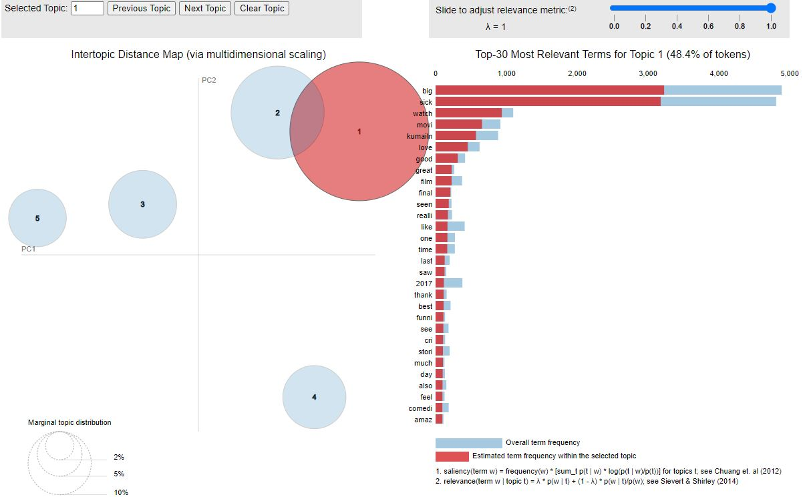
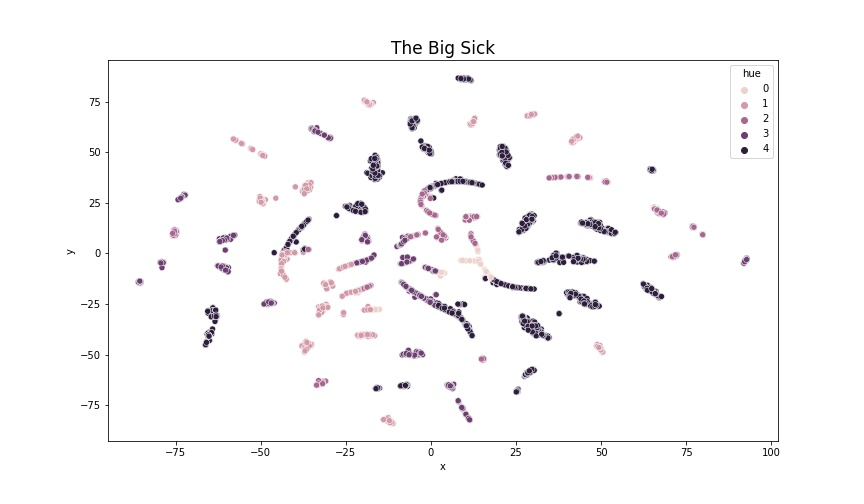
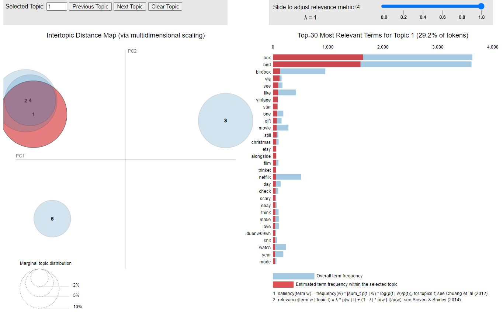
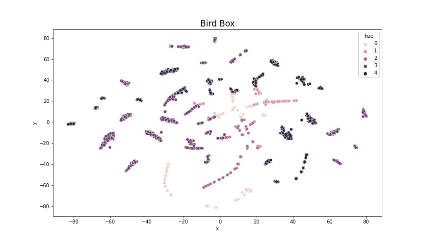
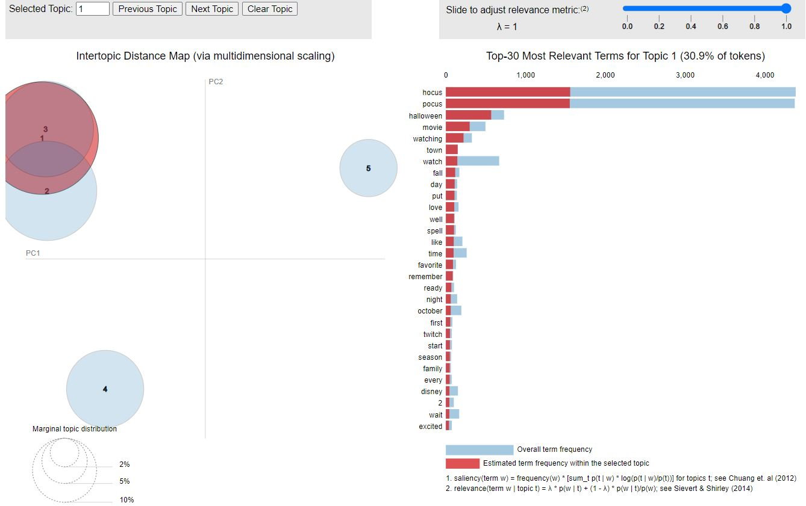
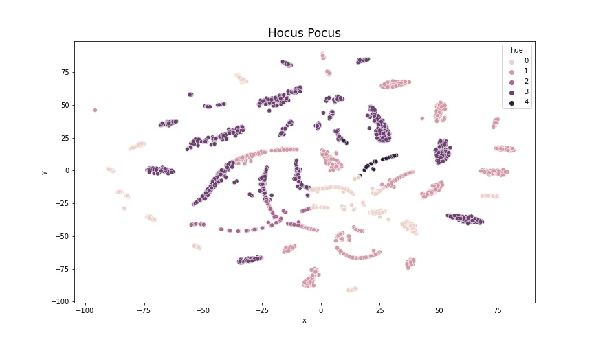

# Twitter Movie Sentiment

## Business Problem
The entertainment business provides people with excitement, relaxation, and an outlet for their emotions. Specifically, movies are an all around escape from reality. Many people work in tandem to create a movie. There are the writers, producers, actors, industy, makeup, PA, and many more jobs. Essentially a movie boils down to trying to please the viewers. Many viewers take to social media outlets, such as twitter to tweet their review. Twitter provides a larger sample size for movie reviews than several critics. A larger sample of movie reviews will lead to a better reflection of the movie. Thus, I used data from Twitter to analyze movie sentiment. Observing what movies the consumer enjoys creates a feedback loop. With feedback movie makers know what kind of content to create based off previous successful movies.

## Data
The API [Twint](https://github.com/twintproject/twint) was used to scrape tweets from 15 movies. The tweets were scraped based on each movies release date. About 5000 tweets were gathered from the time the movie was released until the following year, except for Hocus Pocus. Since Hocus Pocus came out years before twitter, tweets were scraped begin October 2014 to October 2015, the season of Halloween (for a Halloween themed movie). Non-english tweets were removed from the data. The natural language processing packages (NLTK and VaderSentiment) were used. The gensim library was used for topic modeling. 

## Methods

- VADER 
    - [Jack](https://jackmckew.dev/sentiment-analysis-text-cleaning-in-python-with-vader.html)
- LDA   
    - [learningLDA](https://www.youtube.com/watch?v=xvqsFTUsOmc&amp%3Bab_channel=PyOhio) 
    - [kagglelearning](https://www.kaggle.com/yohanb/lda-visualized-using-t-sne-and-bokeh)
    - [learning](https://www.machinelearningplus.com/nlp/topic-modeling-visualization-how-to-present-results-lda-models/)
    - [documentation](https://radimrehurek.com/gensim/models/ldamodel.html)
- TSNE 
    - [JoshStamer](https://www.youtube.com/watch?v=NEaUSP4YerM) 
    - [documentation](https://scikit-learn.org/stable/modules/generated/sklearn.manifold.TSNE.html#examples-using-sklearn-manifold-tsne)

## Results

The following images are bar graphs, kernel density estimates, LDA topic models, and tsne; from 3 of the 15 movies. These VADER images are based off the VADER score, a tweet rating score from -1 to 1. Negative one being perceived as a negative tweet and positive 1 being associated with a positive tweet. Any score between -.1 and .1 was placed in the neutral category. The topic models returned a list of popular words for each topic. It is challenging to decipher between topics.

#### Big Sick

The VADER sentiment score reflects a negative overall score based on tweets. This sentiment conflicts with the critics score on rotten tomates [BigSick_RottenTomatoes](https://www.rottentomatoes.com/m/the_big_sick). 

  
   

After spending countless days wondering why the Big Sick scored so poorly on the VADER test it dawned on me that the word "sick" might be bringing down the score.

Topic 1 seems to be about the movie itself. Topic 2 seems to be about the actors since multiple names are brought up. Topic 3 is predominately numbers and words such as billboard and oscar lead me to believe topic 3 is about ratings and awards.

#### Bird Box

The VADER sentiment score seems lean slightly postive. The sentiment here matches the score on rotten tomatoes [BirdBox_RottenTomatoes](https://www.rottentomatoes.com/m/bird_box). 

  
   

Topic 1 is news related. That is why 'inssurance quotes' and 'Trump' appear. In topic 2, Christmas is mentioned. These must be because Bird Box was released a couple weeks before Christmas. Moviemenfess is a twitter account and Train to Busan, Dilan, and Aladdin are other movies. Therefore topic two must be related to movies and the holidays. Topic 3 encompasses the Irishman, another movie. Topic three seems to be about the movie Bird Box itself because boy and girl refer to two of the characters. Topic three got crossed with anything selling on eBay with the tweets bird and box in them. Topic 4 seems similiar to topic 3. Bobo bird is a type of watch. I imagine it can be purchased online. Christmas is mentioned again. I'm guess topic 4 might relate to Christmas presents. Topic 5 is about the song Bird Box by Skinny Fabulous ft. Travis world and Julius Czar. 

#### Hocus Pocus

Critics rated Hocus Pocus poorly on rotten tomatoes [HocusPocus_RottenTomatoes](https://www.rottentomatoes.com/m/hocus_pocus). According to the positive VADER sentiment collected from tweets, the critics did a terrible job reflecting the overall population. 

  
   

Ariana Grande revealed she was watching Hocus Pocus. Additionally, topic one enconcompasses other Halloween movies like Halloweentown and Twitch. All these are sweeped up into a fall Halloween movie and chill category. Topic 2 seems to be about the actors/characters in the movie. The word, month, in topic 2, refers to October, when all the Halloween films air. Additionally, the word family appears because this particular movie is a family film. Topic 3 involves youtube and the hashtage #mnsshp which stands for Mickey's Not So Scary Halloween Party. Top words put and spell are referring to the popular song I'll Put a Spell on You, in Hocus Pocus. Topic 4 encompasses a movie showing in Chicago at Irving Park Cementary. The words via and etsy leave me to believe topic 5 is about links relating to Hocus Pocus. When I searched through some of the most popular words in topic 5 the tweet with the searched word would contain a link.

## Summary

Many biases needed to be accounted for when looking at twitter movie sentiment. Only a certain group of people will watch a specific movie. Those who like horror movies will watch horror movies. From the specific group only a portion of people take to twitter to write their thoughts. Plus, not all tweets are related to the viewers opinion of the movie. Sometimes viewers tweet about what they're doing while watching the movie, such as, "watching insert-movie-here with mom ... mom hates me." The movie can be good, but the model is going to pick up on the word hate, and the movie will be scored poorly. 

## Next Steps
   - perform a more in depth look into each movie

## Repository Structure

    ├── images                  # wordclouds, frequency bar graphs, VADER bar char, VADER KDE, for each movie
    ├── Twint                   # webscraping of the movie
    ├── Vader                   # VADER model
    ├── LDA TSNE                # LDA and TSNE models
    ├── Deep Dive               # notebook with each tweet for 3 of the 15 movies displayed
    └── README.md               # project recap