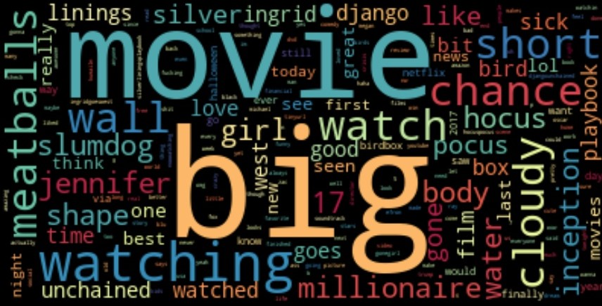
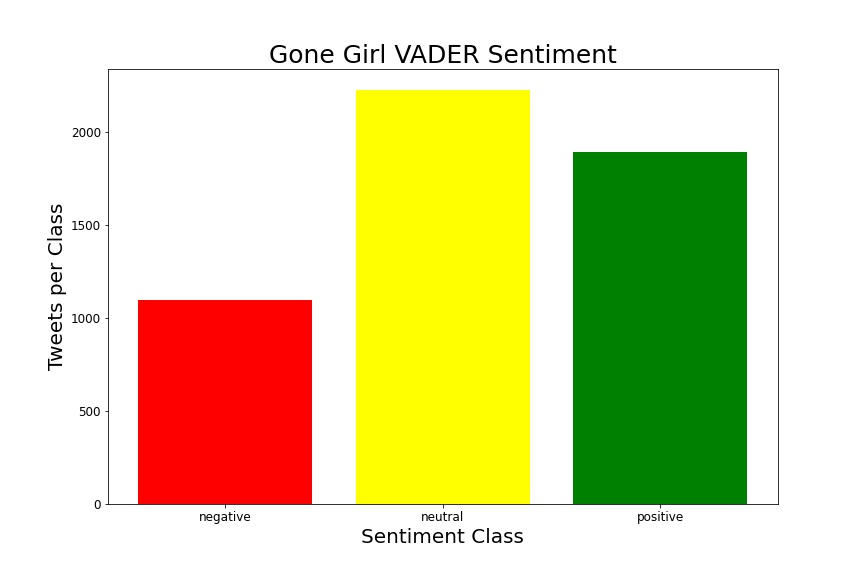

# Twitter Movie Sentiment

## Business Problem
The entertainment business provides people with excitement, relaxation, and an outlet for their emotions. Specifically, movies are an all around escape from reality. Many people work in tandem to create a movie. There are the writers, producers, actors, industy, makeup, PA, and many more jobs. Essentially a movie boils down to trying to please the viewers. Many viewers take to social media outlets, such as twitter to tweet their review. I decided to use the data from Twitter to analyze movie sentiment. Movie sentiment can provide insight to what the consumer enjoys. Observing what movies the consumer enjoys creates a feedback loop. Thus, movie makers know what kind of content to create based off previous successful movies.

## Data
The API [Twint](https://github.com/twintproject/twint) was used to scrape tweets from 15 movies. The tweets were scraped based on each movies release date. About 5000 tweets were gathered from the time the movie was released until the following year, except for Hocus Pocus. Since Hocus Pocus came out years before twitter, tweets were scraped begin October 2014 to October 2015, the season of Halloween (for a Halloween themed movie). Non-english tweets were removed from the data. The Natural Language Processing packages (NLTK and VaderSentiment) were used. 

## Methods

- VADER 
    - [Jack](https://jackmckew.dev/sentiment-analysis-text-cleaning-in-python-with-vader.html)
- LDA   
    - [learningLDA](https://www.youtube.com/watch?v=xvqsFTUsOmc&amp%3Bab_channel=PyOhio) 
    - [kagglelearning](https://www.kaggle.com/yohanb/lda-visualized-using-t-sne-and-bokeh)
    - [learning](https://www.machinelearningplus.com/nlp/topic-modeling-visualization-how-to-present-results-lda-models/)
    - [documentation](https://radimrehurek.com/gensim/models/ldamodel.html)
- TSNE 
    - [JoshStamer](https://www.youtube.com/watch?v=NEaUSP4YerM) 
    - [documentation](https://scikit-learn.org/stable/modules/generated/sklearn.manifold.TSNE.html#examples-using-sklearn-manifold-tsne)

## Results

The following images are bar graphs, kernel density estimates, and histograms. These images are based off the VADER score, a tweet rating score from -1 to 1. Negative one being perceived as a negative tweet and positive 1 being associated with a positive tweet. Any score between -.1 and .1 was placed in the neutral category. 

  
   

  
   

  
   

  
   

  
   

  
   

  
   

  
   

  
   

  
   

  
   

  
   

  
   

  
   

  
   

## Summary

Many biases needed to be accounted for when looking at twitter movie sentiment. Only a certain group of people will watch a specific movie. Those who like horror movies will watch horror movies. From the specific group only a portion of people take to twitter to write their thoughts. Plus, not all tweets are related to the viewers opinion of the movie. Sometimes viewers tweet about what they're doing while watching the movie, such as, "watching insert-movie-here with mom ... mom hates me." The movie can be good, but the model is going to pick up on the word hate, and the movie will be scored poorly. 

## Next Steps
   - perform a more in depth look into each movie

## Repository Structure

    .
    ├── images                  # wordclouds, frequency bar graphs, VADER bar char, VADER KDE, for each movie
    ├── Twint                   # webscraping of the movie
    ├── Vader                   # VADER model
    ├── LDA TSNE                # LDA and TSNE models
    └── README.md               # project recap