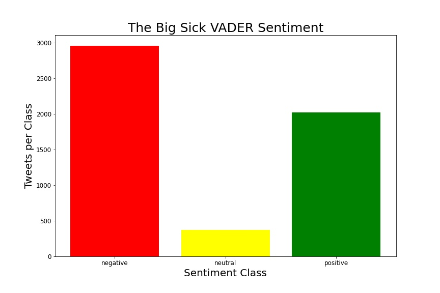
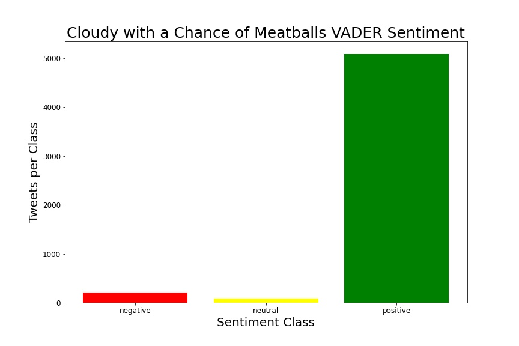

# Twitter Movie Sentiment

## Business Problem
The entertainment business provides people with excitement, relaxation, and an outlet for emotions. Specifically, movies are an all around escape from reality. There are many different aspects of a movie. There are the writers, producers, actors, consumers, industy, makeup, PA, and many more . Essentially a movie boils down to trying to please the viewers. Many viewers take to social media outlets, such as twitter to tweet their review. I decided to use the data from Twitter to analyze movie sentiment. 

## Data
The API [Twint](https://github.com/twintproject/twint) was used to scrape tweets from 15 movies. The tweets were scraped based on each movies release date. About 5000 tweets were gathered from the time the movie was released until the following year, except for Hocus Pocus. Since Hocus Pocus came out years before twitter, tweets were scraped begin October 2019 to October 2020, the season of Halloween (for a Halloween themed movie). Non-english tweets were removed from the data. The Natural Language Processing packages (NLTK and VaderSentiment) were used. 

## Methods

- VADER

## Results

  
   

  
   

  
   

  
   

  
   

  
   

  
   

  
   

  
   

  
   

  
   

  
   

  
   

  
   

## Summary